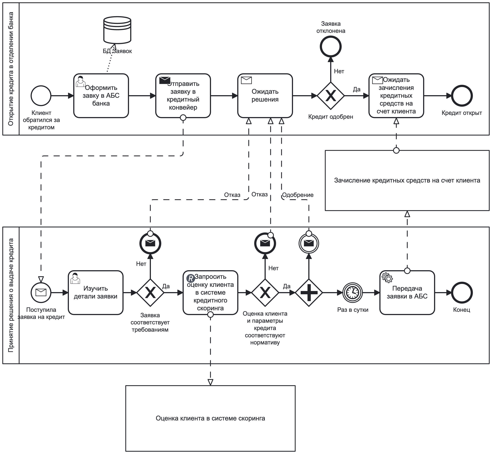
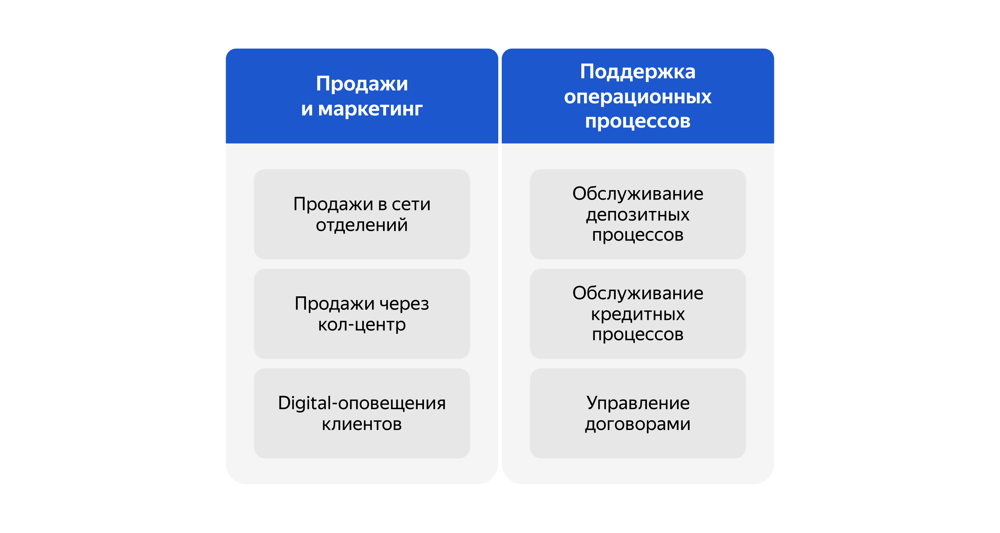
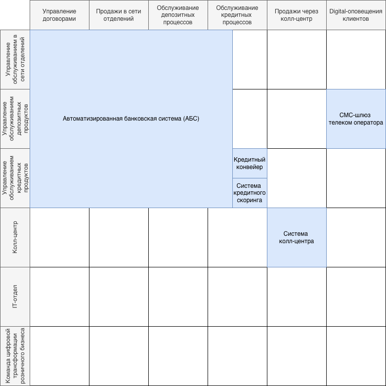
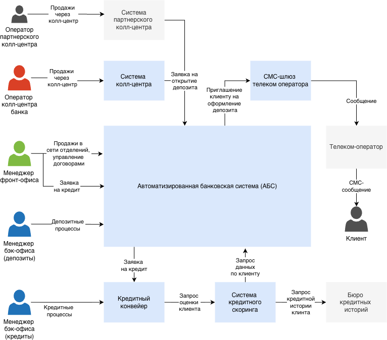

# Задание 1. Карта IT-ландшафта и схема интеграции приложений

## Формирование бизнес-стратегии цифровой трансформации банка

### 1. Определение цели для компании

#### Бизнес-стратегия

Чтобы развиваться дальше, компании нужно привлечь больше клиентов, которые относятся к более молодым категориям. Поэтому сейчас в приоритете развитие онлайн-каналов для привлечения и обслуживания клиентов. Бизнес нуждается в цифровой трансформации.

Компания планирует развивать сайт и интернет-банк, чтобы предоставлять больше продуктов онлайн. Также «Стандарт» может выдавать кредиты и депозиты по ставкам, которые намного выгоднее, чем у большинства конкурентов. Поэтому руководство решило сделать упор на эти продукты в первую очередь.Здесь две ключевые задачи.

1. Интернет-банк:
 * **открытие депозитов и накопительных счетов**  
 Сейчас клиент может открыть депозитные и накопительные счета только в отделении банка. При этом задействованы и фронт-офис, и бэк-офис. Цель на год — сделать так, чтобы клиент мог полностью автоматически открыть депозит или накопительный счёт в интернет-банке, а при обращении в отделение депозит открывался без участия сотрудников бэк-офиса. Но для этого сначала нужно реализовать MVP, где можно оформить заявку на депозит онлайн. Обрабатывать заявки продолжат сотрудники бэк-офиса.

 * **подача кредитной заявки**  
 Ещё за год нужно реализовать подачу кредитной заявки из интернет-банка. При этом клиент сразу должен видеть, сможет ли потенциально получить кредит.Конкуренты делают это через предодобренные предложения. Работает это так: клиент заходит в интернет-банк, видит предодобренное предложение и может сразу заполнить быструю заявку на кредит. Такая заявка будет исполнена в течение одного дня, а не недели, как в обычном случае. 

2. Сайт:
* **подача заявки на кредит**  
В ближайшей перспективе компания хочет, чтобы подать заявку на кредит можно было и на сайте. Когда потенциальный клиент отправит заявку, с ним свяжется менеджер из кол-центра и расскажет об условиях по депозиту.
Банк хочет реализовать механику, когда заявку на кредит можно подать сразу с сайта. Но нужно учитывать, что на этом этапе о клиенте ещё ничего не известно, и вся информация о нём есть только в бюро кредитных историй. 

Итак, зафиксируем, какие цели определил бизнес:   
**Промежуточное состояние (через 6 месяцев)**  
1. Клиент может открыть депозит или накопительный счёт в интернет-банке. В MVP бэк-офис может обрабатывать заявки по старому процессу.

**Финальное состояние (через год)**   
1. Клиент открывает депозит или накопительный счёт в интернет-банке. При этом бэк-офис не участвует в процессе — всё происходит автоматически без участия сотрудников банка. При обращении клиента в отделение банка задействованы только сотрудники фронт-офиса. Это позволит сократить операционные издержки на открытие новых депозитов.
2. Клиент может подать заявку на кредит в интернет-банке и на сайте. При этом в обоих случаях он должен получить решение в течение одного дня, если данных для решения достаточно.

### 2. Описание текущей и целевой структуры бизнеса

#### Схема организационной структуры

#### Карта бизнес-процессов

##### Процесс открытия кредита

#### Карта бизнес-возможностей

#### Бизнес модель

[Business Model Canvas]

### 3. Описание текущей и целевой архитектуры

#### Карта IT-ландшафта

#### Схема интеграции приложений

