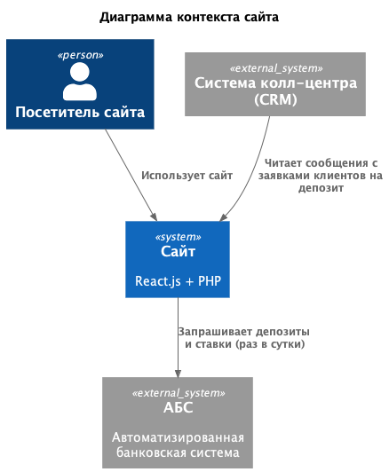
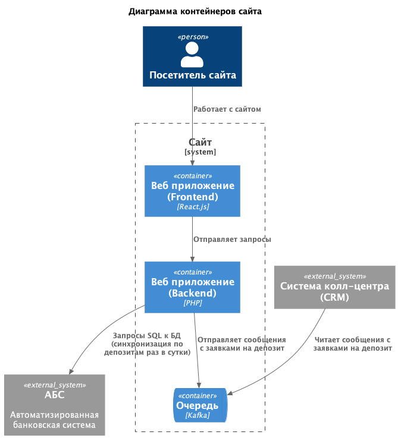
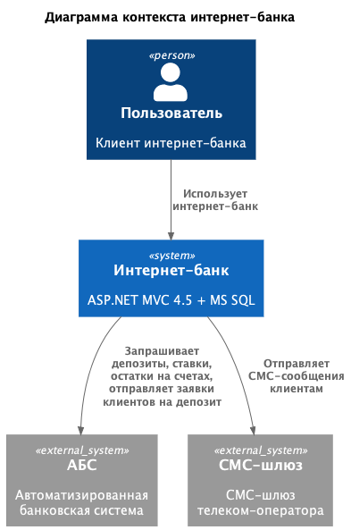
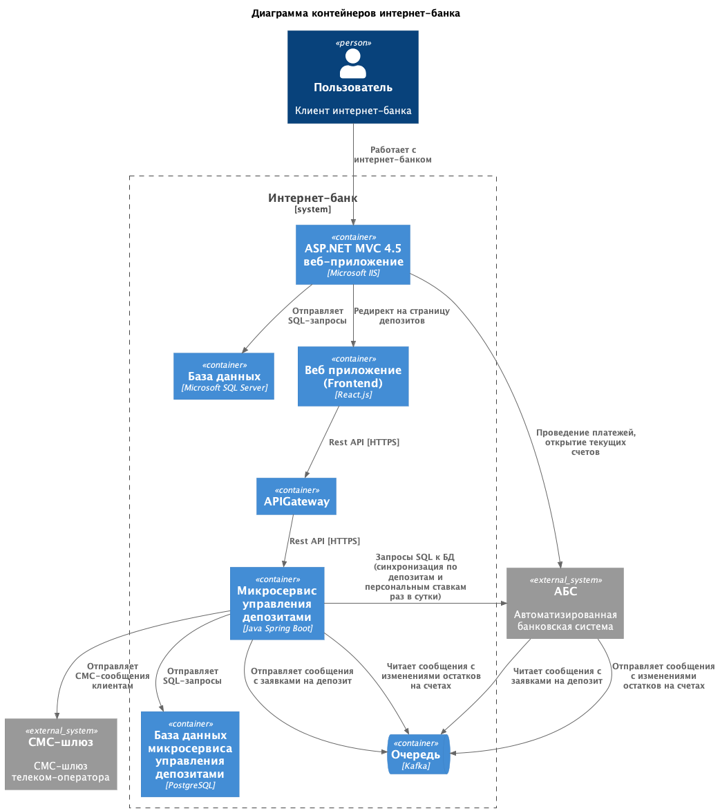
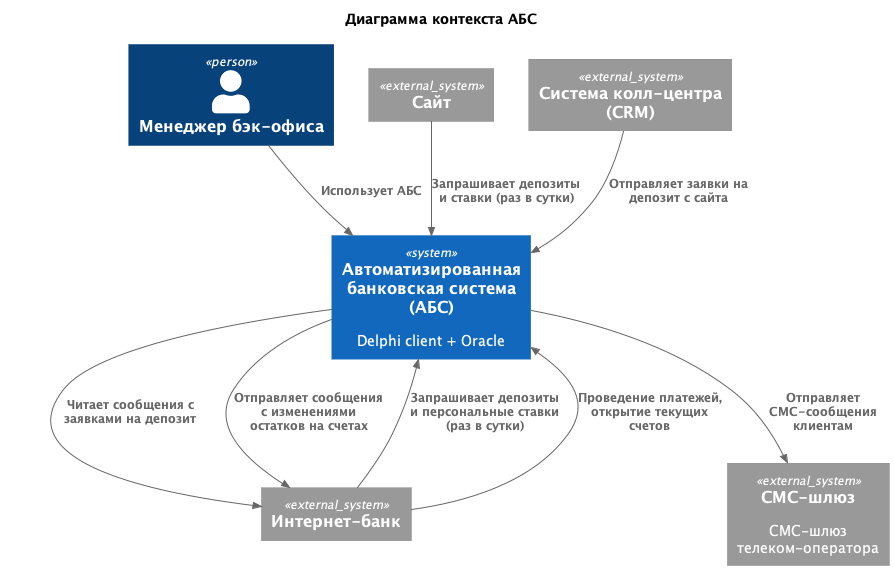
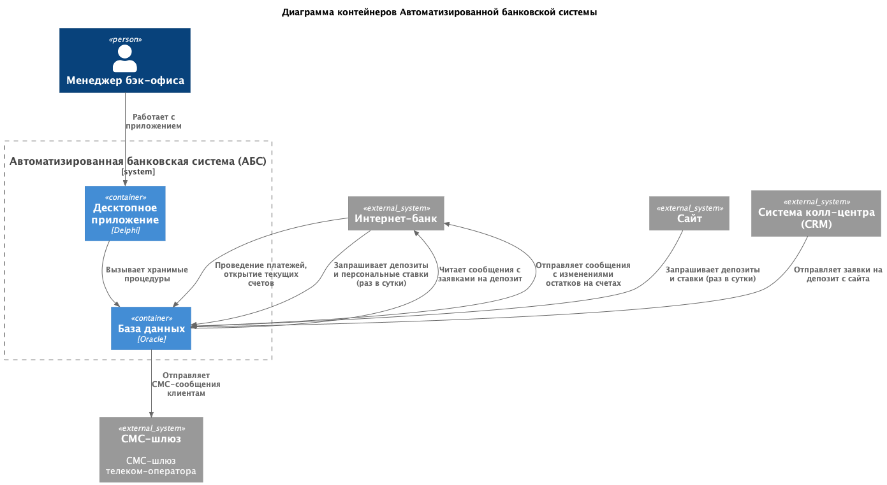

### **Название задачи:** Открытие депозитов онлайн
### **Автор:** avoytenkov@yandex.ru
### **Дата:** 06.01.2026
### **Функциональные требования**

|**№**|**Действующие лица или системы**|**Use Case**|**Описание**|
| :-: | :- | :- | :- |
|UC-DEPONL-01|Пользователь, сайт|Сайт: просмотр списка доступных депозитов с актуальными ставками|1. Пользователь открывает раздел Депозиты на сайте банка.   2. Сайт отображает список доступных депозитов с актуальными ставками|
|UC-DEPONL-02|Пользователь, сайт|Сайт: отправка заявки на депозит|Предусловие: выполнен UC-DEPONL-01 Сайт: просмотр списка доступных депозитов с актуальными ставками.   1. Пользователь выбирает депозит и нажимает кнопку Отправить заявку   2. Сайт выводит форму ввода Ф.И.О. и номера телефона   3. Пользователь заполняет Ф.И.О. и номер телефона и нажимает кнопку Подтвердить данные.   4. Сайт проверяет заполнение обязательных полей (Фамилия, Имя и номер телефона) и соответствие номера телефона шаблону. Если данные введены правильно, сайт выводит сообщение "Заявка отправлена, ожидайте звонка менеджера банка", сохраняет заявку в БД и возвращает пользователя на страницу просмотра списка депозитов. Если данные введены неправильно, сайт отображает ошибку и возвращает пользователя на форму ввода данных для заявки.|
|UC-DEPONL-03|Менеджер бэк-офиса, АБС|АБС: просмотр списка заявок клиентов на депозит|Предусловие: менеджер авторизован в АБС при помощи SSO-авторизации.   1. Менеджер открывает меню Заявки на депозит АБС.   2. АБС отображает список заявок клиентов на депозит|
|UC-DEPONL-04|Пользователь, интернет-банк|Интернет-банк: просмотр списка доступных депозитов с актуальными и персонализированными ставками|Предусловие: выполнен UC-DEPONL-07 Интернет-банк: авторизация по логину и паролю.  1. Пользователь открывает раздел Депозиты в интернет-банке.   2. Интернет-банк отображает список доступных депозитов с актуальными и персонализированными ставками.|
|UC-DEPONL-05|Пользователь, интернет-банк|Интернет-банк: отправка заявки на депозит|Предусловие: выполнен UC-DEPONL-04 Интернет-банк: просмотр списка доступных депозитов с актуальными и персонализированными ставками.  1. Пользователь выбирает депозит и нажимает кнопку Отправить заявку   2. Интернет-банк выводит форму выбора счета и суммы депозита   3. Пользователь выбирает из списка счет, заполняет сумму депозита и нажимает кнопку Подтвердить данные.   4. Интернет-банк проверяет что сумма депозита не превышает остатка на счете клиента. Если данные введены правильно, Интернет-банк выводит сообщение "Введите код из СМС" с запросом кода. Если данные введены неправильно, Интернет-банк отображает ошибку и возвращает пользователя на форму ввода данных для заявки. 5. Пользователь вводит код из СМС.  6. Интернет-банк проверяет СМС. Если данные введены правильно, Интернет-банк выводит сообщение "Заявка отправлена, ожидайте СМС-сообщение с результатами рассмотрения заявки.", сохраняет заявку в БД и возвращает пользователя на страницу просмотра списка депозитов. Если код введен неправильно, интернет-банк отображает ошибку и возвращает пользователя на форму ввода данных для заявки.|
|UC-DEPONL-06|Менеджер бэк-офиса, АБС|АБС: подтверждение заявки клиента на депозит (MVP)|Предусловие: выполнен UC-DEPONL-03 АБС: просмотр списка заявок клиентов на депозит.  1. Менеджер выбирает заявку и если она соответствует регламенту, нажимает кнопку Подвердить, в противном случае нажимает кнопку Отклонить.   2a. Если заявка подтверждена АБС, отправляет СМС сообщение клиенту "Ваша заявка № ... от ... подтверждена, ожидайте открытия депозита в течение суток" и отправляет в очередь запрос на открытие депозита и перевод денежных средств клиента со счета на депозит.   2b. Если заявка отклонена, АБС отправляет СМС сообщение клиенту "Ваша заявка № ... от ... отклонена."|
|UC-DEPONL-07|Пользователь, Интернет-банк|Интернет-банк: авторизация по логину и паролю|1. Пользователь заходит на стартовую страницу Интернет-банка.   2. Интернет-банк выводит форму авторизации с полями логин и пароль.   3. Пользователь вводит логин/пароль в форму авторизации.   4. Интернет-банк проверяет логин и пароль.   4a. При успешной авторизации пользователя создается сессия и происходит переход на заглавную страницу Интернет-банка.   4b. При неуспешной авторизации интернет-банк выводит ошибку авторизации и повторно выводит форму авторизации.|

### **Нефункциональные требования**

|**№**|**Требование**|**Описание**|
| :-: | :- | :- |
| U   | Удобство использования (Usability) |              |
| U1  | Все системы: интерфейс должен соответствовать дизайну приложений, принятому в компании.  |Пользователи при работе должны видеть привычные цвета и брендированные элементы.|
| R   | Надёжность (Reliability)           |              |
| R1  | Все системы: режим работы 24/7||
| R2  | Все системы: доступность 99,9%||
| R6  | Все системы: равномерное горизонтальное масштабирование и распределение запросов между серверами, приложениями и ЦОД.|АБС может масштабироваться только вертикально из-за своей базы данных.|
| P   | Производительность (Performance)   |              |
| P1  | Все системы: отклик по всем операциям должен быть не более 1 секунды.|Чем быстрее, тем лучше, должен занимать миллисекунды.|
| S   | Поддерживаемость (Supportability)  |              |
| S1 | Интернет-банк: функционал работы с СМС, реализованный в ядре системы, должен дорабатываться силами команды разработки банка без привлечения подрядчика.|Клиент-серверная система на веб-фреймворке ASP.NET MVC 4.5 на основе .NET Framework 4.5 и СУБД MS SQL. Монолит реализован на платформе подрядчика.|
| S2 | Все системы: допускается развернуть новые технологии, но необходимо, чтобы они были совместимы с существующими платформами разработки, а у сотрудников банка уже было понимание новых технологий хотя бы на уровне языков программирования.||
| S3 | Все системы: должна быть разработана документация.|Для дальнейшего расширения систем.|
| +R  | + Ограничения (Restrictions)       |              |
| +R2 | Сайт: трафик между клиентом и сайтом должен быть зашифрован.||
| +R3 | Все системы: при доработках нужно как можно больше использовать технологии, которые уже есть в банке. |Например, базы данных MS SQL и Oracle.|
| +R4 | Все системы: на перспективу рекомендуется использовать Kafka в качестве брокера очередей. |Текущая версия платформы интернет-банка несовместима с Kafka.|
| +R5 | Интернет-банк: рекомендуется перевести на микросервисную архитектуру. |Пока только в рамках задачи открытия депозитов.|
| +R6 | Интернет-банк: взаимодействие с API АБС должно быть асинхронным.|БД АБС системы уже перегружена. Онлайн-подача заявок на большое количество продуктов может поставить под угрозу работоспособность банка.|

### **Решение**
Приведите диаграммы контекста и контейнеров в модели C4. Опишите там основные компоненты и интеграции всех элементов решения. 

#### Архитектура сайта

1. Сценарии "Сайт: просмотр списка доступных депозитов с актуальными ставками" (UC-DEPONL-01) и "Сайт: отправка заявки на депозит" (UC-DEPONL-02) относительно несложные, поэтому реализованы в рамках доработок функционала текущего приложения (React.js и PHP). Нет необходимости в изменение технологического стека и разработки сайта с нуля.
2. Заявки клиентов забирает с сайта Система колл-центр, так как это сторонняя CRM и возможности расширения функционала ограничены.
3. Для того, чтобы сильно не усложнять логику сайта, я не стал добавлять API эндпойнт для получения заявок клиентов, а организовал интеграцию через очередь.
4. Для соответствия требованию "Все системы: на перспективу рекомендуется использовать Kafka в качестве брокера очередей" (+R4) используем в качестве брокера очередей Kafka. Клиент PHP для Kafka существует.
5. Депозиты и ставки не меняются в течение дня, поэтому backend сайта запрашивает их напрямую в БД АБС раз в сутки, не создавая постоянной нагрузки. И с точке зрения безопасности Сайт и АБС развернуты в контуре банка.

#### Архитектура интернет-банка

1. Реализованы сценарии:
    * "Интернет-банк: просмотр списка доступных депозитов с актуальными и персонализированными ставками" (UC-DEPONL-04) 
    * "Интернет-банк: отправка заявки на депозит" (UC-DEPONL-05).
2. Для соответствия требованию "Интернет-банк: рекомендуется перевести на микросервисную архитектуру" (+R5) сценарии UC-DEPONL-04 и UC-DEPONL-05 реализованы в отдельном микросервисе. Это также позволяет реализовать требование "Интернет-банк: функционал работы с СМС, реализованный в ядре системы, должен дорабатываться силами команды разработки банка без привлечения подрядчика" (S1). 
3. Точкой входа пока является ASP.NET-приложение, поэтому временно прописываем в нем переадресацию на веб-приложение (Frontend) микросервисов, которое в свою очередь будет перенаправлять запросы на соответствующие микросервисы (пока только Deposit) через API Gateway (REST API).
4. Для соответствия требованию "Все системы: при доработках нужно как можно больше использовать технологии, которые уже есть в банке." (+R3) Frontend будет написан на React.js, микросервис на Java Spring Boot, база данных микросервиса - PostgreSQL.
5. Для соответствия требованиям "Интернет-банк: взаимодействие с API АБС должно быть асинхронным" (+R6) и "Все системы: на перспективу рекомендуется использовать Kafka в качестве брокера очередей" (+R4) используем для интеграции с АБС брокер очередей Kafka. Проблем с совместимостью нет, так как с Kafka взаимодействует не монолит, а микросервис на Java.
6. Kafka будет размещена в контуре интернет-банка, так как интернет-банк движется в сторону микросервисной архитектуры, а АБС уже является Legacy-системой (использующей устаревшую технологию Desktop-клиент и проприетарную БД) и в перспективе тоже будет переведена на микросервисы.
7. Так как остатки на счетах клиентов меняются часто, а синхронное взаимодействие с БД АБС не рекомендуется, АБС отправляет в интернет-банк текущие значения остатка на счете после каждой транзакции через очередь.
8. Аналогично сайту сервис Deposit раз в сутки запрашивает напрямую в БД список депозитов и расчитанные персональные ставки по всем клиентам. Это не должно нагружать БД АБС.
9. Запросы в АБС на проведение платежей и открытие текущих счетов остались, так как эта бизнес-логика осталась в монолите.

#### Архитектура автоматизированной банковской системы (АБС)

1. Реализованы сценарии:
    * "АБС: просмотр списка заявок клиентов на депозит" (UC-DEPONL-03) 
    * "АБС: подтверждение заявки клиента на депозит (MVP)" (UC-DEPONL-06)  
2. Стек не меняем, так как Legacy-архитектура, много взаимодействий с другими системами, переход на микросервисы будет проработан в отдельном ADR. Дорабатываем клиентское приложение (Delphi) и добавляем новые хранимые процедуры в БД Oracle.
3. Заявки с сайта поступают через колл-центр по старой схеме, добавлять очередь не получается пока, так как колл-центр - готовое решение, а АБС решили, что архитектурно менять пока не будем. В будущем АБС будет реализована как отдельный набор микросервисов для решения проблемы с невозможностью выполнить требование "Все системы: равномерное горизонтальное масштабирование и распределение запросов между серверами, приложениями и ЦОД" (R6).
4. Для соответствия требованию "Интернет-банк: взаимодействие с API АБС должно быть асинхронным" (+R6) АБС будет принимать заявки на депозит и отправлять данные по остаткам через очередь. 
5. Доработка для "Интернет-банк: просмотр списка доступных депозитов с актуальными и персонализированными ставками" (UC-DEPONL-04): хранимая процедура по расчету персональных ставок по каждому клиенту, выполняется раз в сутки.

### **Альтернативы**

#### Сайт

1. Реализация REST API эндпойнта для чтения системы колл-центра заявок.
Недостатки:
    * Значительная переработка архитектуры сайта.
    * Необходимость организации БД для хранения заявок.
    * Большая нагрузка на сайт, тяжелые операции list на большую выборку непрочитанных заявок.
    * Сложность синхронизации в случае необходимости повторного запроса заявок (в случае сбоя на стороне колл-центра).

#### Интернет-банк

1. Реализовать новый функционал в монолите.  
    Достоинства:
    * Меньше затрат на разработку.

    Недостатки:
    * Создаем техдолг на переход на микросервисы.
2. Реализовать обмен с АБС через прямой доступ к БД:  
    Достоинства:
    * Меньше затрат на разработку.

    Недостатки:
    * Перегружаем и без того нагруженную БД АБС.
3. Запрос персональных скидок по требованию запуском хранимой процедуры.  
    Достоинства:
    * Меньше затрат на разработку.

    Недостатки:
    * Перегружаем и без того нагруженную БД АБС.
    * Нет необходимости запускать запрос каждый раз по требованию, так как достаточно рассчитать один раз в день.

### **Недостатки, ограничения, риски**

#### Интернет-банк

1. Дополнительные ресурсы на поддержание старой (монолит ASP.NET) и новой (микросервисы) технологий.

#### Автоматизированная банковская система (АБС)

1. Пока оставляем Legacy-систему с проприетарной БД Oracle.
2. АБС не поддерживает горизонтальное масштабирование.
3. БД АБС уже сильно перегружена.

#### Все системы

1. Пока остается "зоопарк" технологий и архитектур.
2. Сайт, интернет-банк и АБС - 3 разные системы, можно было бы объединить в одну.
3. Сайт, интернет-банк и АБС - поддерживаются банком и сторонними подрядчиками.
4. Интернет-банк и АБС - проприетарное ПО, vendor-lock. 

