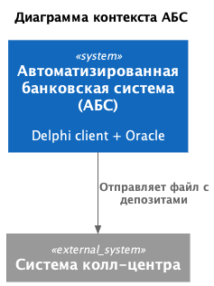
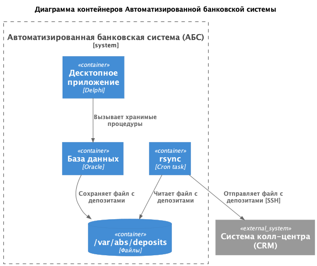

### **Название задачи:** Передача ставок в колл-центр
### **Автор:** avoytenkov@yandex.ru
### **Дата:** 07.01.2026
### **Функциональные требования**

|**№**|**Действующие лица или системы**|**Use Case**|**Описание**|
| :-: | :- | :- | :- |
|UC-DEPTRN-01|АБС, партнерский колл-центр|АБС: Ставки депозитов передаются в колл-центр.|Должна работать автоматика. Периодически через заданный интервал текущий список депозитов с актуальными ставками передаются в виде файла в партнерский колл-центр. Колл-центр может считывать файлы, но нет возможности выполнять API-вызовы (например, через SFTP-протокол)|

### **Нефункциональные требования**

|**№**|**Требование**|**Описание**|
| :-: | :- | :- |
| S   | Поддерживаемость (Supportability)  |              |
| S2 | Все системы: допускается развернуть новые технологии, но необходимо, чтобы они были совместимы с существующими платформами разработки, а у сотрудников банка уже было понимание новых технологий хотя бы на уровне языков программирования.||
| S3 | Все системы: должна быть разработана документация.|Для дальнейшего расширения систем.|
| +R  | + Ограничения (Restrictions)       |              |
| +R2 | Сайт: трафик между клиентом и сайтом должен быть зашифрован.||
| +R3 | Все системы: при доработках нужно как можно больше использовать технологии, которые уже есть в банке. |Например, базы данных MS SQL и Oracle.|
| +R14 | АБС: Файловый обмен между АБС и партнерским колл-центром не должен использовать API-вызовы (например, через SFTP-протокол).|

### **Решение**

#### Архитектура интеграции на стороне АБС

  

1. Для доставки файлов в систему колл-центра предлагаю использовать проверенное решение синхронизации файлов - Rsync.
2. Решение максимально простое - одна команда вида rsync -avz --delete /локальный/источник user@remote-server:/удалённый/приёмник.
3. В качестве транспорта используется SSH.
4. На стороне АБС требутся добавить хранимую процедуру, которая будет периодически выгружать список депозитов и ставки по ним.
5. Команду rsync можно добавить в конфигурацию cron для запуска по расписанию.
6. Со стороны системы колл-центра не требуется сложных доработок. Нам известно, что колл-центр может считывать файлы.
7. Со стороны колл-центра требуется настроить и сообщить команде разработки AБС адрес или имя хоста, порт и путь до файла, а также договориться по используемым ssh-ключам.
8. Операторы колл-центра могут использовать этот файл для получения информации по ставкам, если есть какие-то сложности по загрузке файла в систему колл-центра.
9. Можно поддерживать только одну версию файла, или хранить историю файлов по депозитам на конкретную дату-время.
10. Для безопасности рекомендуется также организовать VPN-канал, например, IPSEC-туннель, между хостом с rsync и целевым хостом на стороне колл-центра.

### **Альтернативы**

1. Передача файлов через электронную почту.  
    Достоинства:
    * Не надо открывать порт и организовывать VPN.

    Недостатки:  
    * Сложнее реализация.  
    * Надо настраивать почтового клиента на стороне колл-центра.

2. Публиковать ставки депозитов на сайте.  
    Достоинства:
    * Вообще не нужна интеграция, операторы заходят на сайт и смотрят актуальныне ставки.

    Недостатки:  
    * Не подходит для непубличной информации.
    * Не ясно насколько важно, чтобы операторы смотрели ставки в интерфейсе колл-центра.

### **Недостатки, ограничения, риски**

1. Риски по безопасности - открытый порт SSH, но это можно митигировать VPN-каналом.