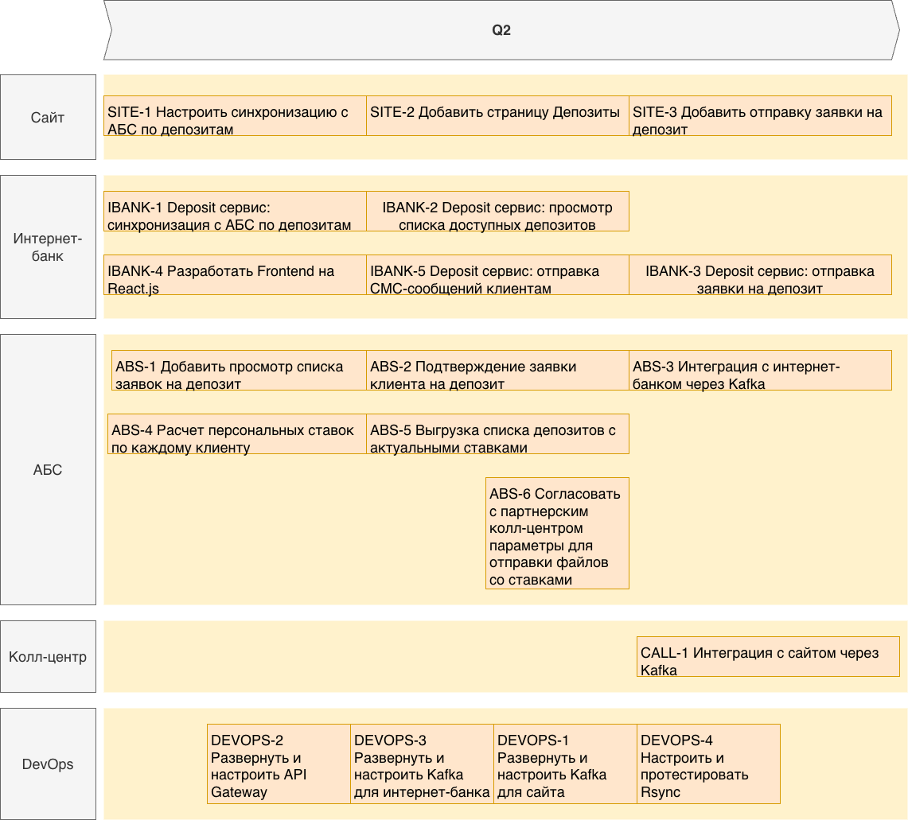

# Задание 4. Передача ставок в колл-центр

[ADR-2-Передача_ставок_в_колл_центр-2026-01-07.md](ADR-2-Передача_ставок_в_колл_центр-2026-01-07.md)

Список задач на реализацию:
|Код|Заголовок|
|--|--|  
|SITE-1|Настроить синхронизацию с АБС по депозитам|
|SITE-2|Добавить страницу Депозиты со списком доступных депозитов с актуальными ставками|
|SITE-3|Добавить отправку заявки на депозит на странице Депозиты|
|DEVOPS-1|Развернуть и настроить Kafka для сайта|
|DEVOPS-2|Развернуть и настроить API Gateway для микросервисов интернет-банка|
|DEVOPS-3|Развернуть и настроить Kafka для интернет-банка|
|DEVOPS-4|Настроить и протестировать Rsync для отправки в колл-центр ставок депозитов|
|IBANK-1|Deposit сервис: синхронизация с АБС по депозитам|
|IBANK-2|Deposit сервис: просмотр списка доступных депозитов с актуальными и персонализированными ставками|
|IBANK-3|Deposit сервис: отправка заявки на депозит|
|IBANK-4|Разработать Frontend на React.js для новых микросервисов|
|IBANK-5|Deposit сервис: отправка СМС-сообщений клиентам|
|ABS-1|Просмотр списка заявок на депозит|
|ABS-2|Подтверждение заявки клиента на депозит|
|ABS-3|Интеграция с интернет-банком через Kafka|
|ABS-4|Расчет персональных ставок по каждому клиенту|
|ABS-5|Выгрузка списка депозитов с актуальными ставками|
|ABS-6|Согласовать с партнерским колл-центром параметры для отправки файлов со ставками|
|CALL-1|Интеграция с сайтом через Kafka|

Дорожная карта проекта:

