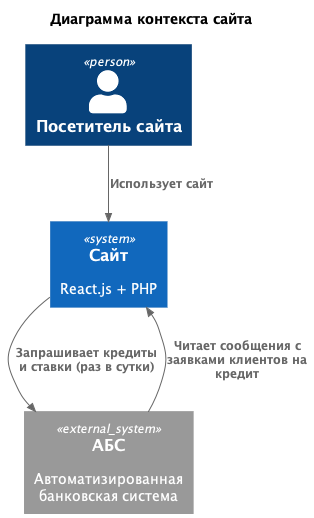
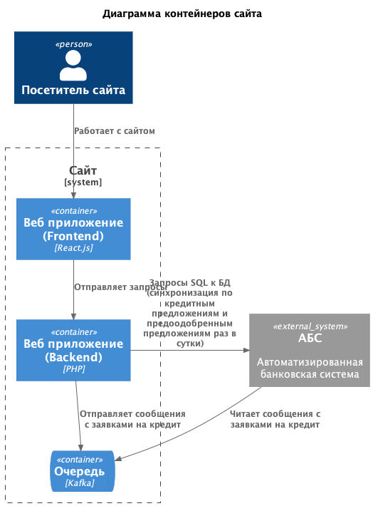
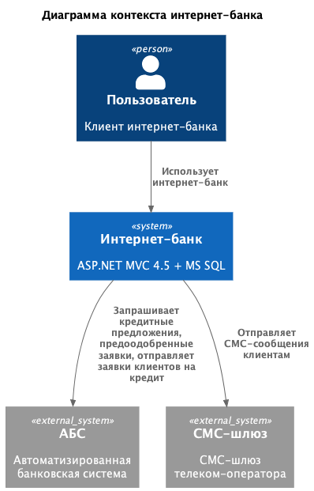
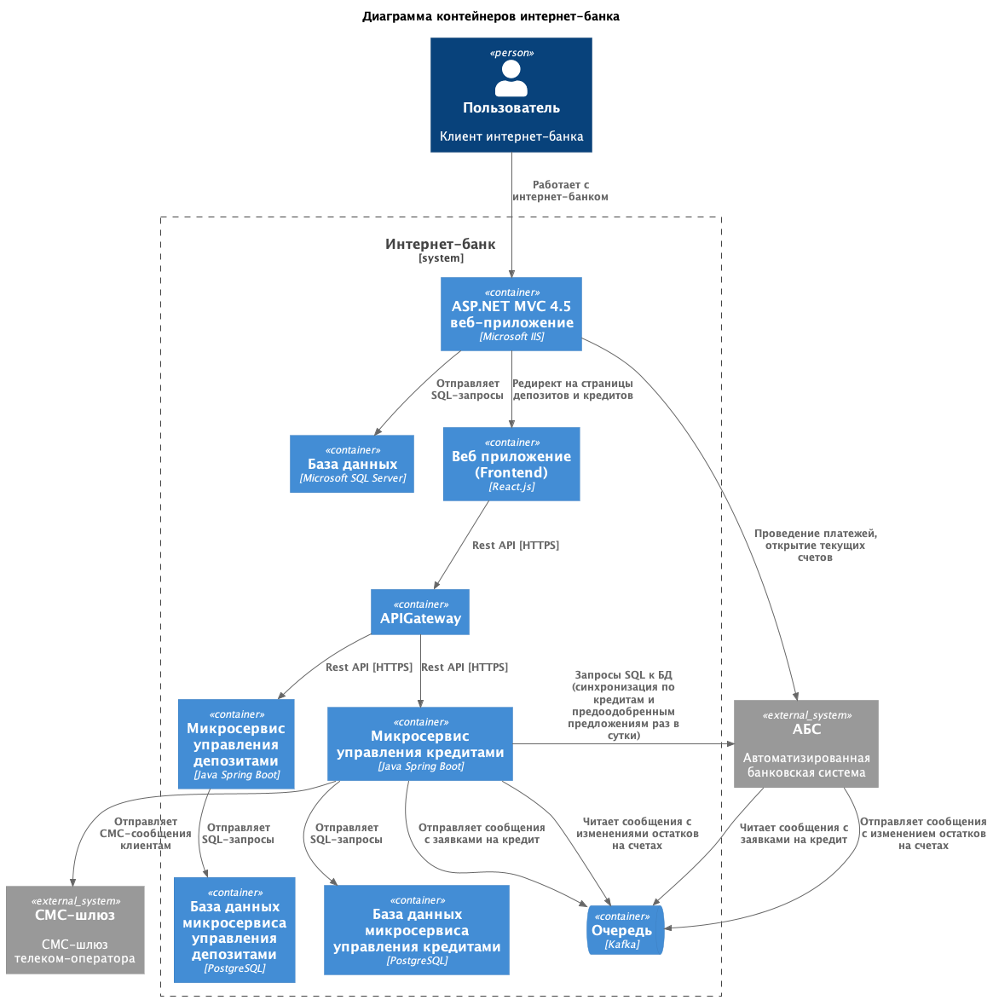
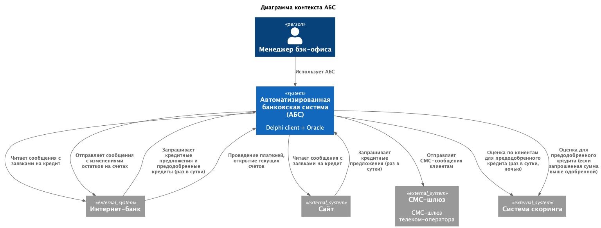
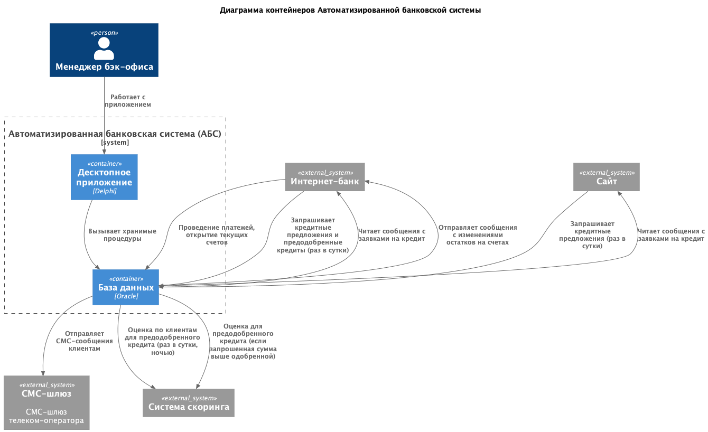

### **Название задачи:** Заявка на кредит онлайн
### **Автор:** avoytenkov@yandex.ru
### **Дата:** 09.01.2026
### **Функциональные требования**

|**№**|**Действующие лица или системы**|**Use Case**|**Описание**|
| :-: | :- | :- | :- |
|UC-CRDONL-01|Пользователь, сайт|Сайт: отображение кредитных предложений с актуальными ставками|1. Пользователь открывает раздел кредиты на сайте банка.   2. Сайт отображает список доступных кредитных предложений с актуальными ставками|
|UC-CRDONL-02|Пользователь, сайт|Сайт: отправка заявки на кредит|Предусловие: выполнен UC-CRDONL-01 Сайт: отображение кредитных предложений с актуальными ставками.   1. Пользователь выбирает кредитное предложение и нажимает кнопку Отправить заявку   2. Сайт выводит форму ввода Ф.И.О., номера телефона и паспортные данные. Ф.И.О. и номер телефона - обязательные поля, паспортные данные - нет.   3. Пользователь заполняет Ф.И.О., номер телефона и паспортные данные и нажимает кнопку Подтвердить данные.   4. Сайт проверяет заполнение обязательных полей (Фамилия, Имя и номер телефона) и соответствие номера телефона шаблону. Если данные введены правильно, сайт выводит сообщение "Заявка отправлена, ожидайте звонка менеджера банка", сохраняет заявку в БД и возвращает пользователя на страницу кредитных предложений. Если данные введены неправильно, сайт отображает ошибку и возвращает пользователя на форму ввода данных для заявки. Если введены паспортные данные и они корректны, сайт выводит сообщение "Заявка отправлена, ожидайте решение по кредиту", клиент с небольшой задержкой получает СМС-сообщение об одобрении или неодобрении ему кредита.|
|UC-CRDONL-03|АБС|АБС: получение решения о выдаче кредита по паспортным данным клиента|Заявки с паспортными данными поступают в АБС, а оттуда сразу в систему кредитного скоринга, минуя Кредитный конвейер, так как пользователь сайта не идентифицирован как клиент банка и данных по такому клиенту в кредитном конвейере нет. Cистема скоринга в свою очередь может использовать только общие данные Бюро кредитных историй. Оценка клиента возвращается обратно в АБС, АБС на основании оценки клиента отправляет СМС-сообщение клиенту с решением по кредиту.|
|UC-CRDONL-04|Менеджер фронт-офиса, АБС|АБС: создание заявки клиента на кредит|Предусловие: менеджер авторизован в АБС при помощи SSO-авторизации.   1. Менеджер открывает меню Заявки на кредит АБС->Новая заявка.  2. АБС выводит форму ввода Ф.И.О., номера телефона и паспортные данные. Ф.И.О. и номер телефона - обязательные поля, паспортные данные - нет.   3. Менеджер заполняет Ф.И.О., номер телефона и паспортные данные и нажимает кнопку Подтвердить данные.   4. АБС проверяет заполнение обязательных полей (Фамилия, Имя и номер телефона) и соответствие номера телефона шаблону. Если данные введены правильно, АБС выполняет поиск по БД завок на кредит, если уже есть предварительное одобрение по кредиту на сайте, выводится процентная ставка и срок действия данного предложения. Если предварительно одобренной заявки нет, создается и сохраняется в БД новая завка. Дальнейший флоу аналогичен для заявки клиента на сайте. Если данные введены неправильно, АБС отображает ошибку и возвращает менеджера на форму ввода данных для поиска заявки.|
|UC-CRDONL-05|Пользователь, интернет-банк|Интернет-банк: просмотр списка доступных кредитов с актуальными  ставками|Предусловие: выполнен UC-DEPONL-07 Интернет-банк: авторизация по логину и паролю.  1. Пользователь открывает раздел Кредиты в интернет-банке.   2. Интернет-банк отображает список доступных кредитов с актуальными ставками. Ещё ему может выводиться предодобренное предложение по кредиту, это означает, что по клиенту в какой-то момент уже произошел скоринг и была рассчитана приемлемая сумма кредита.|
|UC-CRDONL-06|Пользователь, интернет-банк|Интернет-банк: отправка заявки на кредит|Предусловие: выполнен UC-CRDONL-05 Интернет-банк: просмотр списка доступных кредитов с актуальными  ставками.   1. Пользователь выбирает кредитное предложение и нажимает кнопку Отправить заявку   2. Интернет-банк выводит форму выбора счета для зачисления средств.   3. Пользователь выбирает из списка счет, заполняет сумму кредита (или редактирует предварительно одобренную сумму) и нажимает кнопку Подтвердить данные.   4. Интернет-банк выводит сообщение "Введите код из СМС" с запросом кода.  5. Пользователь вводит код из СМС.  6. Интернет-банк проверяет СМС. Если данные введены правильно, Интернет-банк выводит сообщение "Заявка отправлена, ожидайте СМС-сообщение с результатами рассмотрения заявки.", сохраняет заявку в БД и возвращает пользователя на страницу просмотра списка кредитов. Если код введен неправильно, интернет-банк отображает ошибку и возвращает пользователя на форму ввода данных для заявки.|
|UC-CRDONL-07|АБС|АБС: получение решения по кредиту и расчет суммы кредита по заявке из интернет-банка|Если у клиента отобразилось предварительно одобренное предложение и запрошенная клиентом сумма не превышает предодобренную, заявка подтверждается автоматически, АБС отправляет СМС сообщение клиенту "Ваша заявка № ... от ... подтверждена. Ожидайте поступления денежных средств" и отправляет в очередь запрос на открытие кредита и перевод денежных средств на счет клиента.  Если сумма, запрошенная клиентом, выше одобренной, заявка обрабатывается автоматически через систему скоринга. Если запрошенная сумма и оценка клиента в системе скоринга соответствует нормативам, заявка подтверждается автоматически, АБС отправляет СМС сообщение клиенту "Ваша заявка № ... от ... подтверждена. Ожидайте поступления денежных средств" и отправляет в очередь запрос на открытие кредита и перевод денежных средств на счет клиента. Во всех остальных случаях заявка отправляется в кредитный конвейер и обрабатывается менеджером бэк-офиса по стандартной схеме.|
|UC-CRDONL-08|АБС|АБС: подготовка предварительно одобренного кредитного предложения для клиентов банка.|АБС по каждому клиенту, для которого нет или истек срок действия предоодобренного кредитного предложения, выполняется запрос в Систему скоринга оценки клиента. Запрос в Скоринг выполняется в часы наименьшей нагрузки, например, в ночное время. На основании оценки клиента в Системе скоринга и нормативов банка АБС определяет сумму и прочие условия предодобренного кредита и сохраняет их в БД.|

*Для всех Use Cases:
1. АБС: при изменении статуса заявки на кредит система отправляет клиенту соответствующее СМС-уведомление (F17).

### **Нефункциональные требования**

|**№**|**Требование**|**Описание**|
| :-: | :- | :- |
| U   | Удобство использования (Usability) |              |
| U1  | Все системы: интерфейс должен соответствовать дизайну приложений, принятому в компании.  |Пользователи при работе должны видеть привычные цвета и брендированные элементы.|
| R   | Надёжность (Reliability)           |              |
| R1  | Все системы: режим работы 24/7||
| R2  | Все системы: доступность 99,9%||
| R6  | Все системы: равномерное горизонтальное масштабирование и распределение запросов между серверами, приложениями и ЦОД.|АБС может масштабироваться только вертикально из-за своей базы данных.|
| P   | Производительность (Performance)   |              |
| P1  | Все системы: отклик по всем операциям должен быть не более 1 секунды.|Чем быстрее, тем лучше, должен занимать миллисекунды.|
| S   | Поддерживаемость (Supportability)  |              |
| S1 | Интернет-банк: функционал работы с СМС, реализованный в ядре системы, должен дорабатываться силами команды разработки банка без привлечения подрядчика.|Клиент-серверная система на веб-фреймворке ASP.NET MVC 4.5 на основе .NET Framework 4.5 и СУБД MS SQL. Монолит реализован на платформе подрядчика.|
| S2 | Все системы: допускается развернуть новые технологии, но необходимо, чтобы они были совместимы с существующими платформами разработки, а у сотрудников банка уже было понимание новых технологий хотя бы на уровне языков программирования.||
| S3 | Все системы: должна быть разработана документация.|Для дальнейшего расширения систем.|
| +R  | + Ограничения (Restrictions)       |              |
| +R2 | Сайт: трафик между клиентом и сайтом должен быть зашифрован.||
| +R3 | Все системы: при доработках нужно как можно больше использовать технологии, которые уже есть в банке. |Например, базы данных MS SQL и Oracle.|
| +R4 | Все системы: на перспективу рекомендуется использовать Kafka в качестве брокера очередей. |Текущая версия платформы интернет-банка несовместима с Kafka.|
| +R5 | Интернет-банк: рекомендуется перевести на микросервисную архитектуру. |Пока только в рамках задачи открытия депозитов.|
| +R6 | Интернет-банк: взаимодействие с API АБС должно быть асинхронным.|БД АБС системы уже перегружена. Онлайн-подача заявок на большое количество продуктов может поставить под угрозу работоспособность банка.|
| +R7 | АБС: желательно, чтобы заявки на кредит по предодобренным предложениям обрабатывались сотрудниками в течение того же рабочего дня.|Сейчас заявки попадают в Кредитный конвейер раз в сутки из АБС. При этом ускорить обмен между базами и проводить его чаще невозможно.|
| +R14 | Система кредитного скоринга: cистема кредитного скоринга очень важна для работы банка и испытывает повышенную нагрузку в рабочие часы, её не нужно нагружать дополнительными процессами по предрасчетам скорингов. ||

### **Решение**
Приведите диаграммы контекста и контейнеров в модели C4. Опишите там основные компоненты и интеграции всех элементов решения. 

#### Архитектура сайта

  

1. Сценарии "Сайт: отображение кредитных предложений с актуальными ставками" (UC-CRDONL-01) и "Сайт: отправка заявки на кркдит" (UC-CRDONL-02) относительно несложные, поэтому реализованы в рамках доработок функционала текущего приложения (React.js и PHP). Нет необходимости в изменение технологического стека и разработки сайта с нуля.
2. Для соответствия требованиям "Интернет-банк: взаимодействие с API АБС должно быть асинхронным" (+R6) и "Все системы: на перспективу рекомендуется использовать Kafka в качестве брокера очередей" (+R4) используем для интеграции с АБС брокер очередей Kafka. Клиент PHP для Kafka существует.
3. Кредитные предложения и ставки не меняются в течение дня, поэтому backend сайта запрашивает их напрямую в БД АБС раз в сутки, не создавая постоянной нагрузки. И с точке зрения безопасности Сайт и АБС развернуты в контуре банка.

#### Архитектура интернет-банка

1. Реализованы сценарии:
    * "Интернет-банк: просмотр списка доступных кредитов с актуальными  ставками" (UC-CRDONL-05) 
    * "Интернет-банк: отправка заявки на кредит" (UC-CRDONL-06).
2. Для соответствия требованию "Интернет-банк: рекомендуется перевести на микросервисную архитектуру" (+R5) сценарии UC-CRDONL-05 и UC-CRDONL-06 реализованы в отдельном микросервисе. Это также позволяет реализовать требование "Интернет-банк: функционал работы с СМС, реализованный в ядре системы, должен дорабатываться силами команды разработки банка без привлечения подрядчика" (S1). 
3. Для соответствия требованиям "Интернет-банк: взаимодействие с API АБС должно быть асинхронным" (+R6) и "Все системы: на перспективу рекомендуется использовать Kafka в качестве брокера очередей" (+R4) используем для интеграции с АБС брокер очередей Kafka. Проблем с совместимостью нет, так как с Kafka взаимодействует не монолит, а микросервис на Java.
4. Kafka будет размещена в контуре интернет-банка, так как интернет-банк движется в сторону микросервисной архитектуры, а АБС уже является Legacy-системой (использующей устаревшую технологию Desktop-клиент и проприетарную БД) и в перспективе тоже будет переведена на микросервисы.
5. Так как остатки на счетах клиентов меняются часто, а синхронное взаимодействие с БД АБС не рекомендуется, АБС отправляет в интернет-банк текущие значения остатка на счете после каждой транзакции через очередь.
6. Аналогично сайту сервис Credit раз в сутки запрашивает напрямую в БД список кредитных предложений и предодобренные кредиты. Это не должно нагружать БД АБС.

#### Архитектура автоматизированной банковской системы (АБС)

1. Реализованы сценарии:
    * "АБС: получение решения о выдаче кредита по паспортным данным клиента" (UC-CRDONL-03) 
    * "АБС: создание заявки клиента на кредит" (UC-CRDONL-04)  
    * "АБС: получение решения по кредиту и расчет суммы кредита по заявке из интернет-банка" (UC-CRDONL-07)  
    * "АБС: подготовка предварительно одобренного кредитного предложения для клиентов банка" (UC-CRDONL-08)  

2. Стек не меняем, так как Legacy-архитектура, много взаимодействий с другими системами, переход на микросервисы будет проработан в отдельном ADR. Дорабатываем клиентское приложение (Delphi) и добавляем новые хранимые процедуры в БД Oracle.
3. Для соответствия требованию "Интернет-банк: взаимодействие с API АБС должно быть асинхронным" (+R6) АБС будет принимать заявки на депозит и отправлять данные по остаткам через очередь. 

### **Альтернативы**

#### Интернет-банк

1. Реализовать новый функционал в монолите.  
    Достоинства:
    * Меньше затрат на разработку.

    Недостатки:
    * Создаем техдолг на переход на микросервисы.
2. Реализовать обмен с АБС через прямой доступ к БД:  
    Достоинства:
    * Меньше затрат на разработку.

    Недостатки:
    * Перегружаем и без того нагруженную БД АБС.

### **Недостатки, ограничения, риски**

#### Интернет-банк

1. Дополнительные ресурсы на поддержание старой (монолит ASP.NET) и новой (микросервисы) технологий.

#### Автоматизированная банковская система (АБС)

1. Пока оставляем Legacy-систему с проприетарной БД Oracle.
2. АБС не поддерживает горизонтальное масштабирование.
3. БД АБС уже сильно перегружена.

#### Все системы

1. Пока остается "зоопарк" технологий и архитектур.
2. Сайт, интернет-банк и АБС - 3 разные системы, можно было бы объединить в одну.
3. Сайт, интернет-банк и АБС - поддерживаются банком и сторонними подрядчиками.
4. Интернет-банк и АБС - проприетарное ПО, vendor-lock. 

